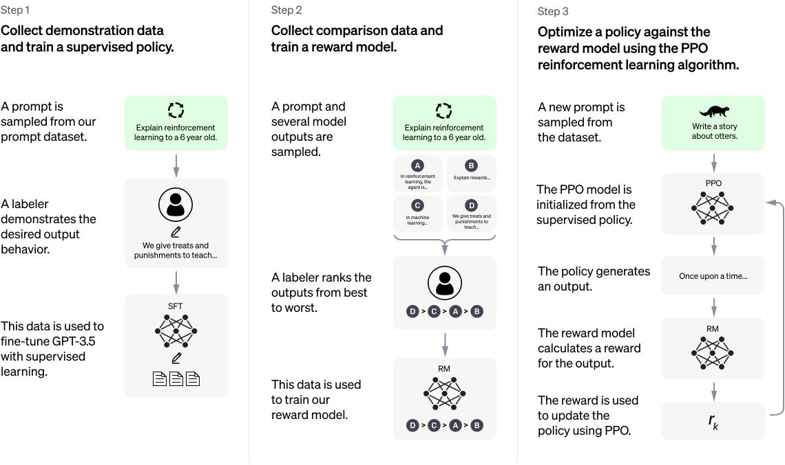

# llm-rlhf-fly
基于 [基于TRL库](https://github.com/lvwerra/trl) 构建ChatGPT训练流程



# Step1

```shell
python train_sft.py
```

# Step2

```shell
python train_reward.py
```

# Step3

```shell
python train_rl.py
```